# 프로젝트 개요

**팀명:** GOATHub

**프로젝트 제목:** GOATube

**Github:** https://github.com/sysmae/GOAThub

**목적:**  
유튜브 영상 링크를 입력받아 대본을 추출하고, 요약 노트를 생성하며,
이를 노션에 저장할 수 있는 서비스입니다.  
이 기반으로 채팅 기능도 제공하여 사용자와 소통하는 서비스로 확장 가능합니다.

**팀원 역할:**

## Contributors

- sysmae (김진현)
- tpcks75 (김세찬)
- Dagun2000 (이정우)
- ggyhun (김경훈)

- **김진현:** 프로젝트 총괄, 일정 및 리뷰 주도, 초기 핵심 기능 구현 및 개발 환경 셋팅, 프롬프트 엔지니어링
- **김세찬:** CI / CD 구축, 배포 및 운영, AWS EC2 환경 셋팅
- **이정우:** API 통합 및 데이터 처리, 프롬프트 엔지니어링
- **김경훈:** 소스코드 관리, 문서화, 발표

## 기술 스택

- **프론트엔드:** Streamlit
- **백엔드:** Python + Langchain
- **데이터 저장:** Notion API 연동 (결과 저장)
- **배포:** Streamlit Cloud -> AWS EC2 (Docker)
- **협업 도구:** GitHub, Notion, Perplexity Space

## 주요 기능 (MVP 목표)

- [x] 유튜브 링크 입력 → 대본 추출
- [x] 대본 요약 및 노트 생성
- [x] 노션에 저장
- [x] 모델 선택, 요약 길이, 언어 선택 가능

## MVP 핵심 기능

- [x] 직관적 UI 제공 (Streamlit)
- [x] 유튜브 영상 링크 입력 후, 대본 추출 및 요약
- [x] 노션 저장 기능 연동

## 향후 확장 고려 기능

- [x] 긴 영상 대본 섹션별 요약
- [x] 모델 등 사용자 맞춤형 옵션 제공
- [x] 다국어 지원 (한국어, 영어 등)
- [x] 챗봇 기능 등

# 프로젝트 설치 및 실행

## 개발 및 실행 환경 설정

1. **필수 패키지 설치**

실행에 필요한 필수 모듈을 설치하기위해 프로젝트 디렉터리 위치의 터미널에서 아래 명령어를 실행시켜주세요.

```bash
pip install -r requirements.txt
```

2. **환경 변수 설정**

`.env` 파일을 프로젝트 `app.py`가 존재하는 디렉터리에 생성하고 API key를 입력하세요.

```env
GOOGLE_API_KEY=your_google_api_key_here
OPEN_AI_API_KEY=your_openai_api_key_here
APIFY_API_TOKEN=your_apify_api_token_here
```

## 프로젝트 실행 방법

프로젝트를 실행하기 전 `개발 및 실행 환경 설정`을 선행해주세요.

1. **실행 명렁어**

```bash
streamlit run src/app.py
```

2. **도커 활용**

```bash
docker build -t goathub-app .
docker run -p 8501:8501 --env-file src/.env goathub-app
```

# 사용 방법

## 화면 구성

프로젝트를 실행시키면, 다음과 같은 웹 추기 화면을 확인할 수 있습니다.

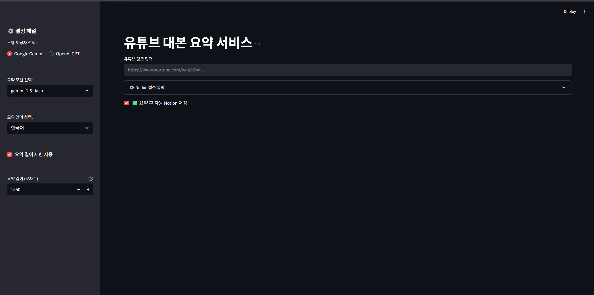

## 세팅

### 유튜브 링크 입력

요약하고자 하는 유튜브 영상의 링크를 입력합니다.

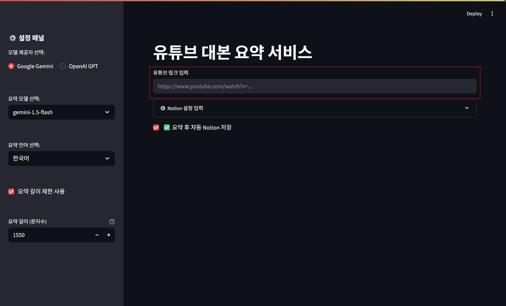

### Notion 설정 입력

자신의 노션 API와, 저장할 노션 데이터베이스 링크를 입력합니다.

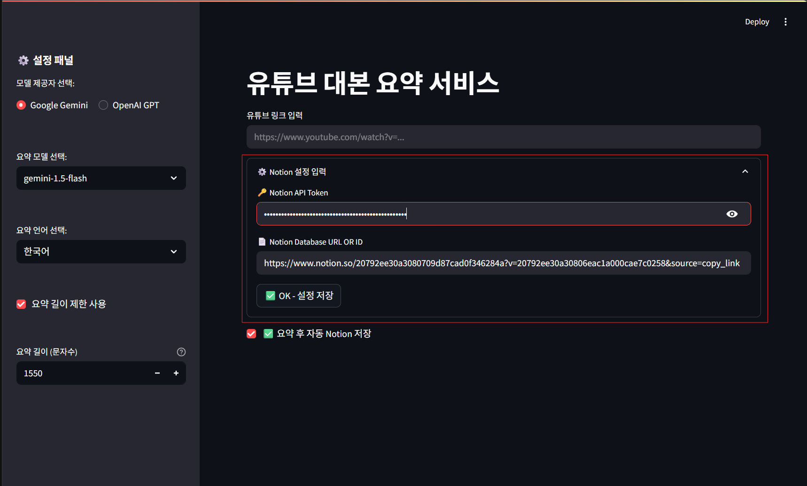

## 요약

### 대본 추출

유튜브 링크를 입력하면 오른쪽 하단에 유튜브 영상과 함께 추출된 영상 대본이 표시됩니다.

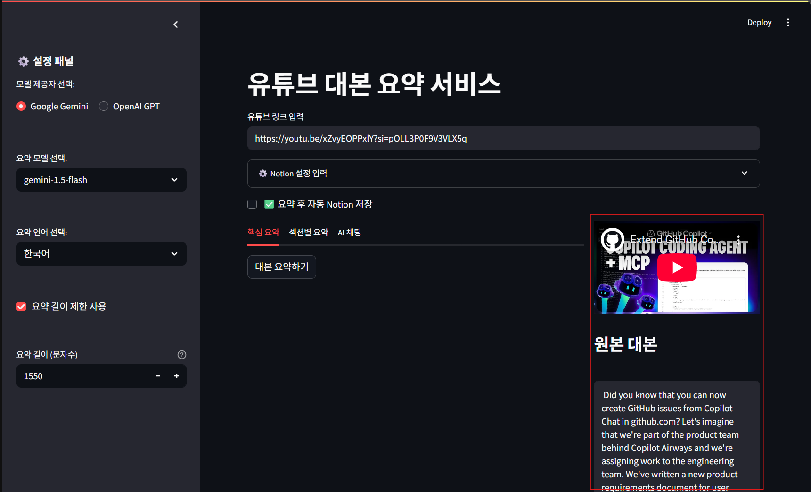

### 핵심 요약

`핵심 요약` 섹션에서 `핵심 요약 생성` 버튼을 클릭하면 일반적인 요약 노트가 생성됩니다.

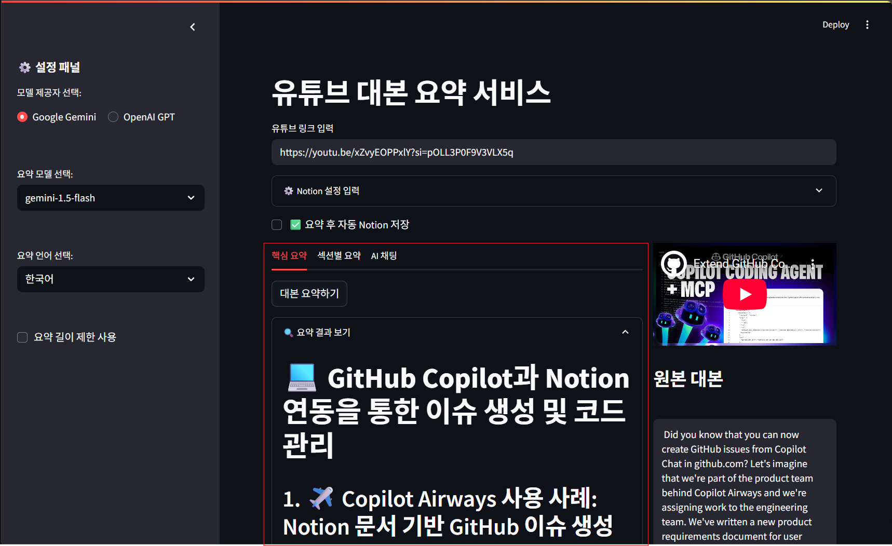

### 섹션별 요약

`섹션별 요약` 섹션에서 `섹션별 요약 생성` 버튼을 클릭하면 섹션별 요약 노트가 생성됩니다.

대본에서 섹션을 나눠서 요약하기 때문에 **길이가 긴 영상을 요약하고자 하는 경우** 유용합니다.

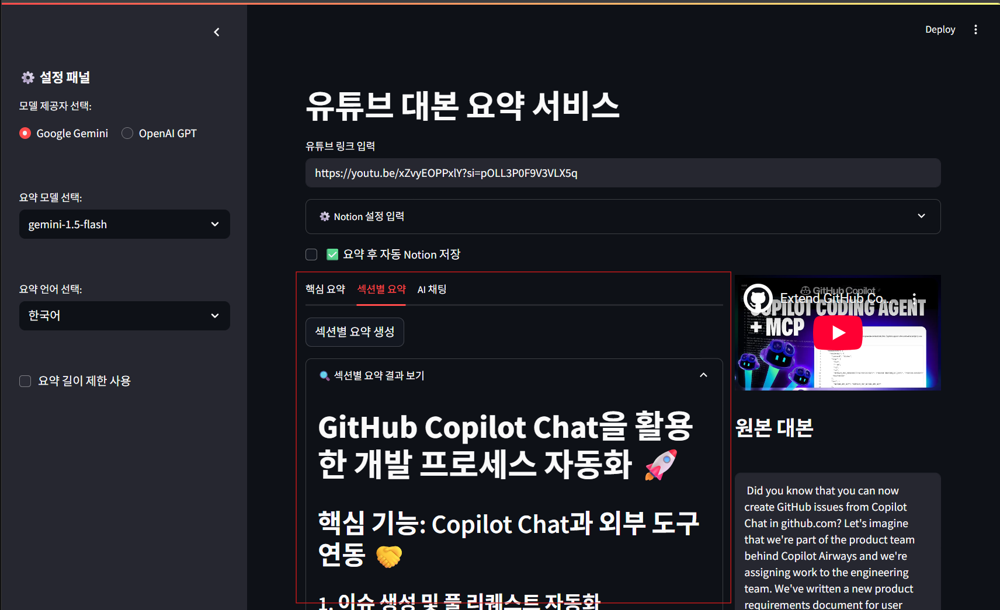

### AI 채팅

`AI 채팅` 부분에서 영상 요약을 기반으로한 챗봇과 대화할 수 있습니다.

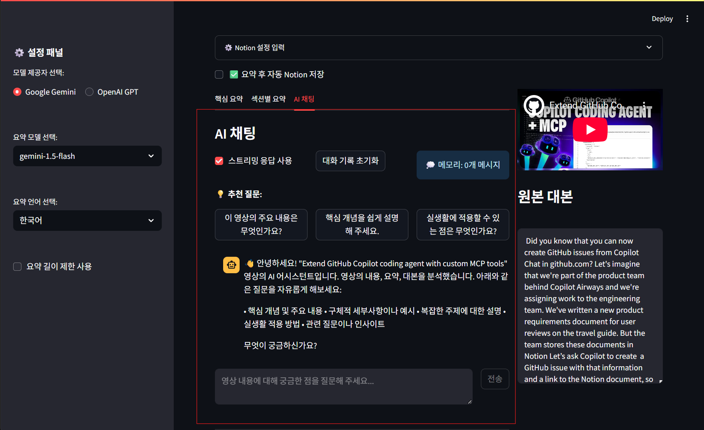

## 요약 설정

### 요약 AI 선택

요약 설정은 창의 왼쪽에서 설정할 수 있습니다.

`모델 제공자 선택`은 `Google Gemini`와 `OpenAI GPT`의 두가지 선택지를 제시하며, `요약 모델 선택`에서 세부적인 모델을 선택 가능합니다.

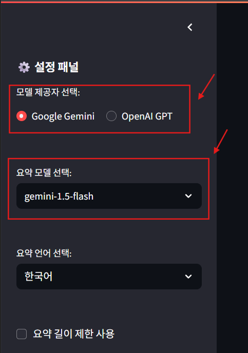

### 요약 언어 선택

`요약 언어 선택`에서 요약 노트를 어떤 언어로 생성할 지 선택할 수 있습니다. 한국어를 포함한 7가지 언어를 제공합니다.

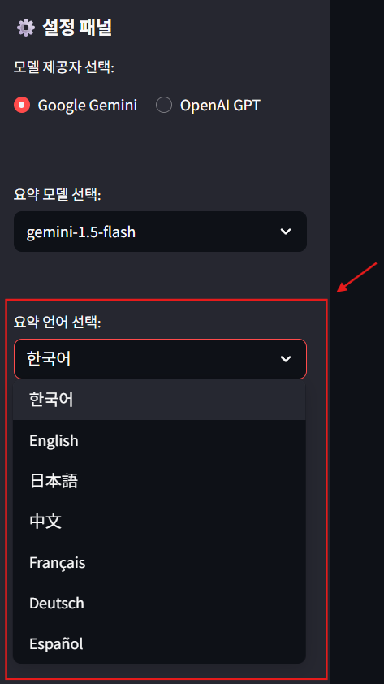

### 요약 길이 제한

`요약 길이 제한` 항목을 체크할 경우 요약 길이를 수정할 수 있는 옵션이 나타납니다. 문자수 200이상 3000이하의 값으로 설정할 수 있습니다.
또한 200에서 500자 사이의 경우 짧은 요약, 500에서 1500자 사이의 경우 중간 요약, 1500자 이상의 경우 긴 요약으로 분류되어 서로 다른 프롬프트가 적용됩니다.

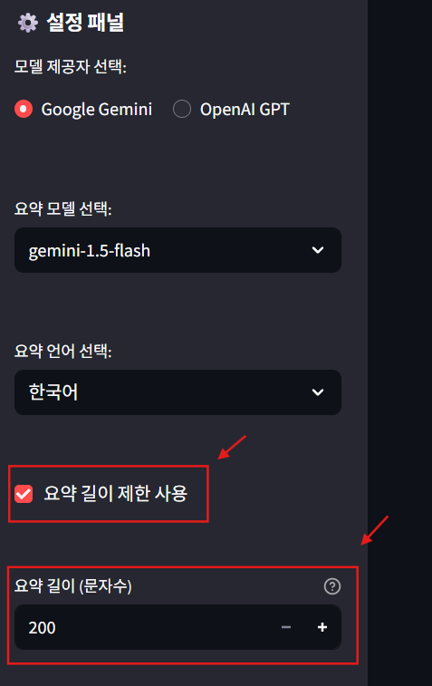

## 추가 작업

### 요약 노트 다운로드

`핵심 요약`과 `섹션별 요약`에서 생성된 요약 노트에 대해 `.md` 형식으로 다운로드할 수 있습니다.

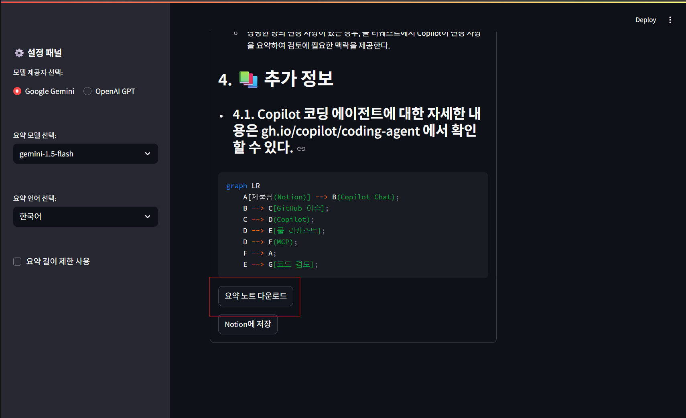

### Notion 저장

생성된 요약 노트를 Notion 설정에 따라 사용자가 입력한 Notion 데이터베이스에 저장할 수 있습니다.

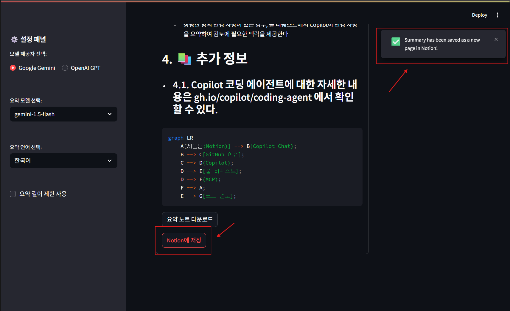

# 프로젝트 기여 방법

`README`에서는 간략한 개요만 전달합니다. 추가적인 세부 사항은 `CONTRIBUTING.md`를 확인해주세요.

## 프로젝트 진행 방법

1. **작업 전:** `main` 브랜치 최신 상태로 pull
2. **브랜치 생성:**

```bash
git checkout -b feature/기능명
```

3. **개발 후 커밋:**

```bash
git add .
git commit -m "feat: 새로운 기능 설명"
```

4. **원격 푸시:**

```bash
git push origin feature/기능명
```

5. **PR 생성:**  
   GitHub에서 `main` 대상 PR 생성 후, 리뷰 및 승인받기  
   (자동 린트 검사, 테스트 통과 필수)

## 기여 방법

- 이슈 등록 및 해결
- 기능 개발 후 PR 요청
- 코드 리뷰 후 머지
