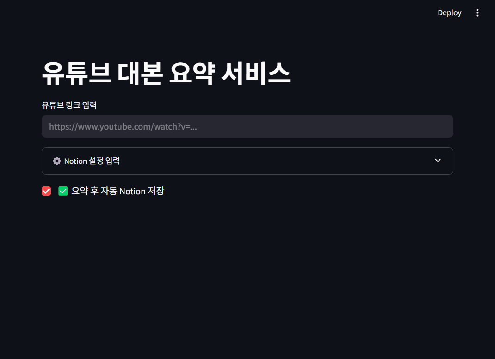
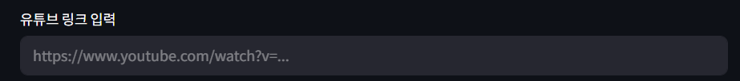
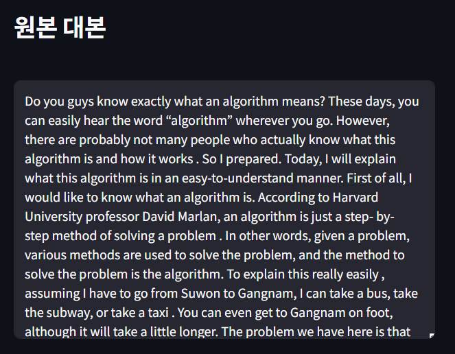
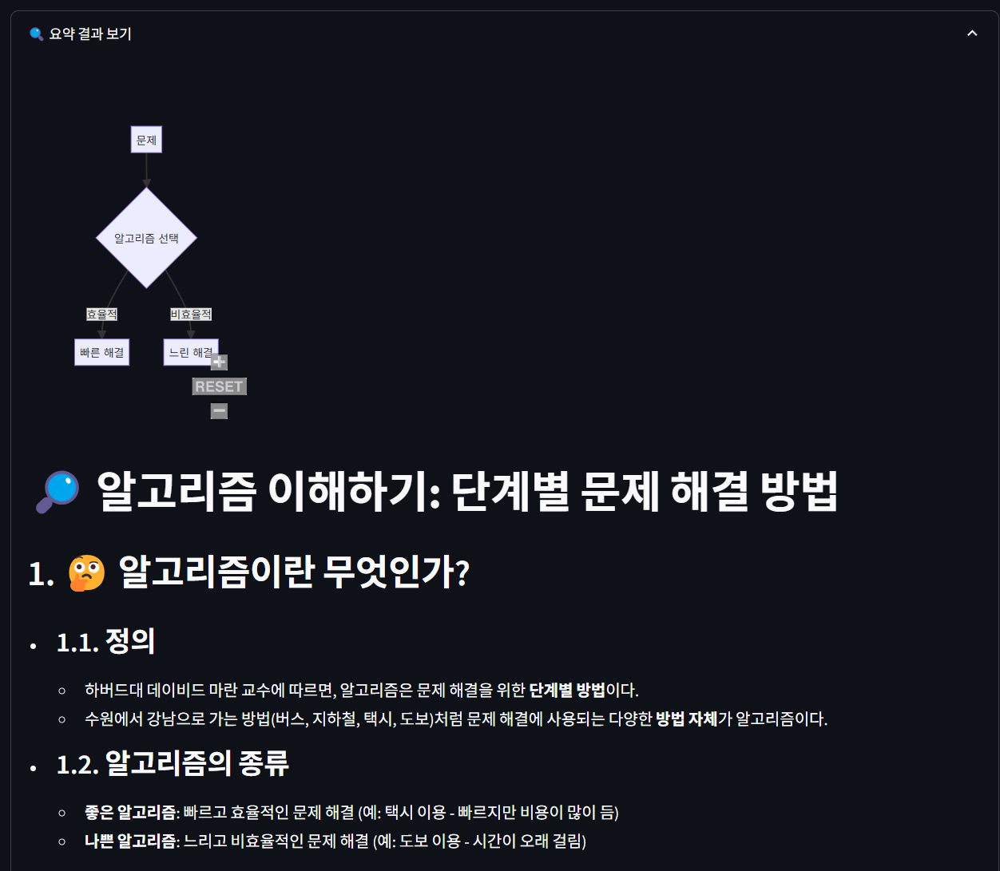
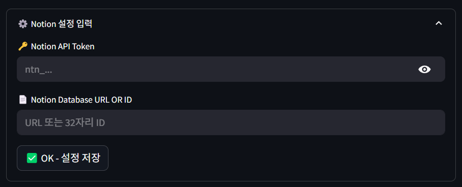
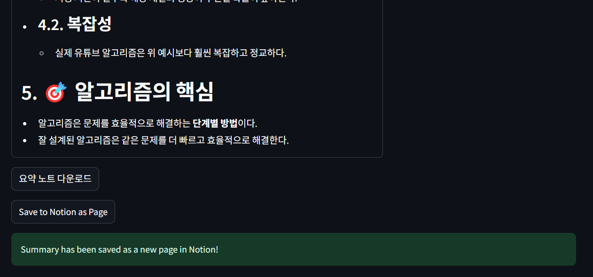
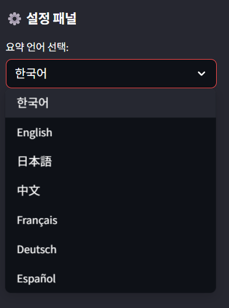

# GOATube 진행 보고서

## 1. 프로젝트 개요

### GOATube 프로젝트

GOATube는 유튜브 영상 링크를 입력받아 대본을 추출하고, AI 기반 요약 노트를 생성하여 노션에 저장할 수 있는 서비스입니다.
본 서비스는 긴 영상 내용을 효율적으로 학습하고 정리하려는 사용자들의 시간 절약과 생산성 향상을 목표로 합니다.

이 프로젝트의 핵심 기능은 다음과 같습니다:

- 유튜브 링크 입력을 통한 자동 대본 추출
- Google Gemini API를 활용한 구조화된 요약 노트 생성
- Notion API 연동을 통한 자동 저장 및 관리
- 직관적인 웹 인터페이스 제공

### 프로젝트 구성원

- **팀장**: 김진현
- **AI모델**: 이정우
- **배포**: 김세찬
- **문서/발표**: 김경훈

### 필요한 API 항목

이 프로젝트를 실행하기위해 필요한 API는 다음과 같습니다.

- Gemini API Key
- Webshare proxy 인증 정보 (선택사항)
    - Webshare proxy는 대본 추출 과정에서 유튜브 정책으로 인해 밴을 먹을 경우 사용됩니다.
    - 정상적인 작동 과정에선 필요하지 않습니다.

자세한 사항은 Github에 업로드된 `how_to_get_API_keys.md`를 확인해주세요.

### 로컬에서 프로젝트를 실행하는 방법

1. 모듈 설치를 위해 프로젝트 디렉터리에서 콘솔창을 열고, 다음 명령어를 실행해주세요.

```bash
pip install -r requirements.txt
```

2. `app.py`가 존재하는 디렉터리에 `.env` 파일을 생성하고 자신의 API 키를 `.env.example`을 참고하여 작성해주세요.

3. 실행을 위해 프로젝트 디렉터리에서 콘솔창을 열고, 다음 명령어를 실행해주세요.

```bash
streamlit run src/app.py
```

4. Notion 저장을 위한 API Key를 발급받고, 저장할 노션의 페이지 또는 데이터베이스를 다음과 같이 설정해주세요.
    1. https://www.notion.com/my-integrations 접속
    2. "New integration" 클릭
    3. 이름 설정 (예: GOATube Integration)
    4. 권한 설정에서 Insert Content, Read Content 체크
    5. 저장할 데이터베이스에서 우측 상단 ... → 연결 → 해당 Integration을 초대
    6. Submit 후 발급된 Token 복사 (secret_... 또는 ntn_... 형식)
    7. 앱 실행 후 입력란에 다음 정보 입력:
        - Notion API Token
        - Notion Database URL 또는 ID

API 관련 세부 정보는 `how_to_get_API_keys.md`를 확인해주세요.

## 2. GOATube 프로젝트의 MVP

### MVP 핵심 기능

MVP에서 구현해야할 핵심 기능 항목은 다음과 같습니다.

1. 유튜브 링크 입력 & 대본 추출
    - 사용자가 유튜브 링크를 입력하면 해당 영상의 정보를 가져와 대본을 추출합니다.
3. 요약 노트 생성
    - 추출한 대본을 기반으로 요약된 노트를 생성합니다.
4. Notion 저장
    - 생성된 요약 노트를 사용자의 Notion 페이지 또는 데이터베이스에 저장합니다.
5. UI 제공
    - 직관적으로 사용할 수 있도록 구성된 간단한 인터페이스를 제공합니다.

### MVP의 수치적 점검

MVP의 완성도를 수치적으로 평가할 수 있는 항목은 다음과 같습니다.

1. 유튜브 링크 처리
    - 90% 이상의 자막 추출 성공률
2. 요약 품질
    - 핵심 내용이 빠지지않은 요약 제공
3. Notion 연동
    - Notion API 연결 성공률 90% 이상
4. 처리 속도
    - 링크 입력부터 노션 저장까지 10분 이내 처리
5. UI
    - 링크 입력부터 노션 저장까지 3단계 이내로 수행할 수 있도록 합니다.

## 3. MVP 대비 현재 구현 완료된 기능

현재 GOATube 프로젝트는 MVP 구현을 완료하였으며, MVP에서 제외한 기능들을 구현하고 있습니다.

- [x] 유튜브 링크 입력 & 대본 추출
- [x] 요약 노트 생성
- [x] Notion 저장
- [x] UI 제공

### UI 제공

Streamlit을 사용함으로써 사용자의 편의성을 중심으로 요약할 유튜브 영상 입력창과 Notion 설정창을 제공합니다.



### 유튜브 링크 입력 & 대본 추출

- 초기 UI에 표시되는 `유튜브 링크 입력`란에 유튜브 링크를 입력할 수 있습니다.



- 유튜브 링크가 정상적으로 입력되면 대본 추출 결과를 표시합니다.




### 요약 노트 생성

- 영상으로부터 정상적으로 대본이 추출된 후 사용자가 `요약 결과 보기`를 클릭하면 하단에 영상 요약 결과를 표시합니다.



### Notion 저장

- `Notion 저장` 기능은 먼저 `Notion 설정 입력` 창에 자신의 Notion API Token과 저장할 노션 페이지 URL을 입력합니다.



- 영상 요약이 완료되면 하단에 `요약 노트 다운로드` 버튼과 `Save to Notion as Page` 버튼이 생성됩니다. `Save to Notion as Page` 버튼을 누르면 앞서 설정한 Notion 설정에 따라 노션에 요약 결과를 저장합니다.
- 저장이 완료되면 사진과 같이 저장 완료 메시지가 표시됩니다.



### 요약 언어 선택

- `요약 언어 선택` 기능은 요약을 어떤 언어로 진행할지에 대한 설정을 제공하며, 웹의 좌측에서 선택할 수 있습니다.



## 4. 주요 기술적 도전 과제 및 해결 방안

### 1. YouTube API 접근 제한 문제

**도전 과제**: 네트워크
- 네트워크 제한으로 인한 대본 추출 실패
- Youtube의 봇 트래픽 차단 정책으로 인한 접근 제한

**해결 방안**:
- Webshare 프록시 서버 구성 및 연동으로 네트워크 제한 우회
- 최대 3회 재시도 로직 구현으로 일시적 네트워크 오류 대응
- JSON, XML, TTML 등 다양한 Content-Type에 따른 자막 파싱 처리
- User-Agent와 Accept-Language 헤더 최적화로 정상 사용자 트래픽 모사

### 2. 대용량 텍스트 처리 문제

**도전 과제**: 대용량 처리
- 긴 영상의 대본 처리 시 성능 이슈 및 API 제한 문제

**해결 방안**:
- 텍스트 청킹 처리 구현으로 대본을 적절한 크기로 분할
- Notion 블록 단위 분할 저장 기능 구현 (최대 1800자 단위)
- Mermaid 다이어그램 지원으로 복잡한 내용의 시각화

### 3. AI 모델 최적화

**도전 과제**: 프롬포트 엔지니어링
- 요약 품질과 응답 시간의 균형
- 일관된 출력 형식 보장

**해결 방안**:
- 체계적인 프롬프트 엔지니어링을 통한 요약 품질 향상
- Gemini-1.5-flash 모델 선택으로 속도와 품질의 최적 균형점 확보
- SystemMessagePromptTemplate 활용으로 Markdown 형식 출력 강제
- API 사용량 초과 등 예외 상황에 대한 명확한 오류 메시지 제공

### 4. Notion API 연동 최적화

**도전 과제**: 노션 연동
- 노션 페이지 생성 및 복잡한 포맷팅 처리

**해결 방안**:
- Markdown 텍스트를 Notion 블록으로 변환하는 알고리즘 자체 개발
- 굵은 글씨, 기울임 등 리치 텍스트 포맷팅 지원
- 대용량 페이지 처리를 위한 블록 청크 단위 API 호출 최적화
- 영상 썸네일 자동 추출 및 커버 이미지 설정 기능

## 5. 남은 작업(To-Do) 및 리스크

### To-Do

다음 기능들이 계획되었으며, 현재 개발중에 있습니다:

- 섹션 분류 및 섹션별 요약 제공
- 모델 선택 옵션 제공
- 대본 기반 챗봇 구현

### 리스크

위 기능들이 구현되는 과정에서 예상해볼 수 있는 리스크는 다음과 같습니다:
1. API 사용량 및 비용 증가

- **설명:** Google Gemini API, Notion API 등 외부 서비스의 사용량이 증가할 경우, 예기치 않은 비용 발생 및 서비스 제한이 발생할 수 있습니다.
- **대응 방안:**
    - 요청 횟수 제한, 대체 모델/서비스 준비

2. 대용량 데이터 처리 시 성능 저하

- **설명:** 긴 영상의 대본의 경우, 텍스트 청킹, 요약, 저장 과정에서 성능 저하 및 지연이 발생할 수 있습니다.
- **대응 방안:**
    - 효율적인 청킹 및 요약 프롬포트 개선

3. Notion API 포맷 변경 및 예외 상황

- **설명:** Notion API의 포맷 변경, 일시적 장애, 블록 단위 제한 등으로 인해 저장 실패 또는 데이터 손실이 발생할 가능성이 있습니다.
- **대응 방안:**
    - 예외 처리 강화
    - 저장 실패 시 재시도 로직

4. AI 요약 품질 및 일관성 문제

- **설명:** 다양한 영상 주제 및 길이에 따라 요약 품질이 들쭉날쭉할 수 있으며, 프롬프트 엔지니어링의 한계로 일관된 결과가 보장되지 않을 수 있습니다.
- **대응 방안:**
    - 프롬프트 지속 개선
    - 많은 테스트 케이스 적용 및 검토
    - 다양한 모델 실험 및 품질 평가 체계 도입


## 6. 피드백 받고자하는 항목

아래 항목들에 대해 교수님의 피드백을 받고 싶습니다:

1. **핵심 기능 보완**
    - 현재 선정한 MVP에 추가/보완이 필요한 부분이 있는지

2. **기술 스택 및 아키텍처**
    - 사용한 API(Gemini, Notion 등)와 전체적인 기술 구조가 적절한지
    - 대체 가능한 기술이나 더 효율적인 방법이 있는지

3. **UI/UX 설계**
    - 사용자 인터페이스가 직관적이고 사용하기 쉬운지
    - 추가적으로 고려해야 할 UX 요소가 있는지

4. **데이터 처리 및 성능**
    - 대용량 영상 대본 처리, 요약, 저장 과정에서의 성능 이슈에 대한 우려 및 개선 방향

5. **확장성 및 추가 아이디어**
    - 향후 어떤 기능을 추가하면 좋을지, 서비스 확장 방향에 대한 조언

6. **기타 전반적인 개선점**
    - 프로젝트 전반에서 미처 고려하지 못한 부분이나, 보완해야 할 점

피드백이 없어도 된다고 판단되는 항목은 제외하셔도 괜찮습니다. 교수님의 다양한 시각에서의 조언과 피드백을 부탁드립니다.
