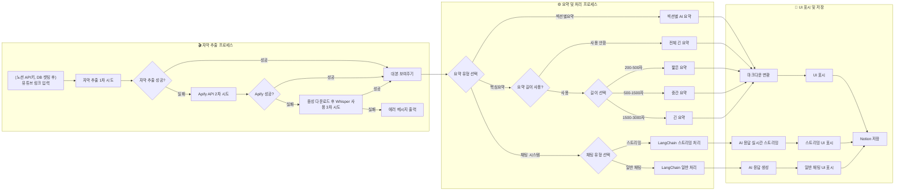
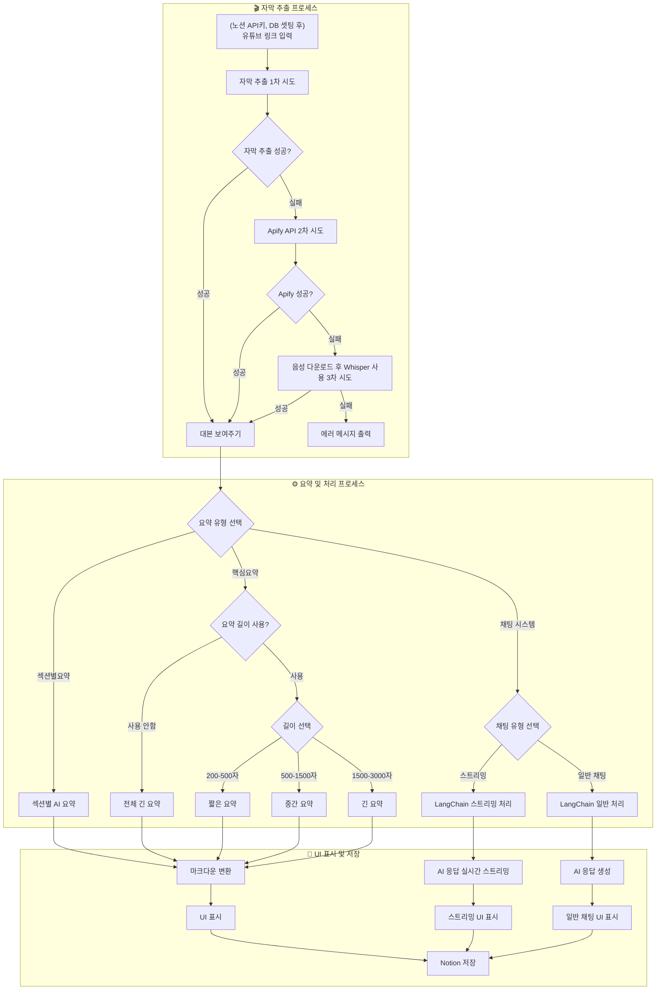

# GOATHhb 최종 보고서

> Github 주소 : [https://github.com/sysmae/GOAThub](https://github.com/sysmae/GOAThub)
>
> Github / 프로젝트 내 최종보고서 위치 : [docs/GOAThub\_최종보고서.md](https://github.com/sysmae/GOAThub/blob/main/docs/GOAThub_%EC%B5%9C%EC%A2%85%EB%B3%B4%EA%B3%A0%EC%84%9C.md)

---

## 1. 프로젝트 개요

**GOATube**는 유튜브 영상의 자막을 자동 추출하고, AI 기반으로 구조화된 요약을 생성하여 Notion에 자동 저장하는 오픈소스 솔루션입니다. 수 많은 정보가 넘쳐나는 현대 사회에서 빠르게 유튜브 영상을 소비하고, 필요한 정보를 찾는 것이 중요해졌습니다. GOATube는 이러한 요구를 충족시키기 위해 개발되었습니다.

다른 영상 요약 서비스와 차별화된 점은 다음과 같습니다:

- **AI 요약**: Google Gemini와 OpenAI GPT를 활용한 고품질 요약
- **다국어 지원**: 한국어, 영어, 일본어 등 7개 언어로 요약 가능
- **직관적인 UI**: Streamlit 기반의 다국어 지원하는 사용자 친화적인 웹 인터페이스
- **Notion 통합**: 요약 결과와 채팅을 Notion에 저장하여 추가적인 사용자 사용 용이

---

## 2. 팀 구성 및 역할

- **김진현**: 프로젝트 리더, 핵심 기능 구현, 프롬프트 엔지니어링
- **김세찬**: DevOps, 인프라 관리, 배포 자동화
- **이정우**: 백엔드, API 통합, 데이터 처리
- **김경훈**: 문서화, QA, 발표

---

## 3. 주요 기능 및 구현 내용

### 3.1 AI 기반 요약

- **Google Gemini** (1.5-Flash, 2.0-Flash 등), **OpenAI GPT** (4.1-nano, 4o-mini 등) 선택 가능
- **요약 유형**:
  - **핵심 요약**: 영상 전체 내용을 간결하게 요약
  - **섹션별 요약**: 긴 영상을 여러 구간으로 나누어 상세 분석
- **다국어 지원**: 한국어, 영어, 일본어 등 7개 언어 지원, UI 및 모든 프롬프트 다국어 처리
- **요약 길이 조절**: 사용자 입력 기반 요약 길이 설정

**요약 처리 상세 흐름:**

- 사용자가 Streamlit UI에서 유튜브 URL을 입력하면, 영상 ID를 추출하고 링크를 포맷팅합니다.
- 1차로 YouTube Transcript API를 통해 자막을 추출합니다. 프로젝트 초기에는 잘 작동했지만 유튜브 정책 변경 때문인지 자주 실패합니다. 실패 시 2차로 Apify API로 재시도, 이마저도 실패하면 3차로 영상 음성을 다운로드하여 OpenAI의 Whisper API로 대본을 생성합니다. Apify API의 경우 무료 계정으로도 최대 1달에 약 714 개 요청 가능합니다.
- 자막 추출 성공 시, AI 요약 처리 단계로 진입합니다.
- 사용자는 요약 유형(핵심 요약/섹션별 요약)을 선택할 수 있습니다. - **핵심 요약**: 요약 길이 옵션을 선택하면, 문자수 200~3000의 값으로 설정할 수 있습니다.
  또한 200~500자 사이의 경우 짧은 요약, 500~1500자 사이의 경우 중간 요약, 1500자 이상인 경우 해당 길이에 맞는 프롬프트로 AI 요약을 생성합니다. - **섹션별 요약**: 대본을 10000 청크를 기준으로 여러 섹션으로 분할하여 각 구간별로 AI 요약을 수행한 다음, 결과를 통합하여 최종 요약을 생성하고 각 과정에서 생성된 섹션을 포함해 결과를 보여줍니다.
- 생성된 요약 결과는 마크다운으로 변환되어 UI에 표시되고, 필요시 Notion에 저장할 수 있습니다.

### 3.2 대화형 AI

- 영상 요약 기반 Q\&A 챗봇
- 실시간 스트리밍 응답, 컨텍스트 유지

**채팅 처리 상세 흐름:**

- 사용자가 채팅 시스템을 선택하면, 채팅 유형(실시간 스트리밍/일반 채팅)을 고를 수 있습니다.
  - **실시간 스트리밍**: LangChain 스트리밍 기능을 통해 AI 응답이 실시간으로 UI에 표시됩니다.
  - **일반 채팅**: LangChain 일반 처리로 AI 응답을 한 번에 생성하여 UI에 표시합니다.
- 모든 채팅 결과는 필요시 Notion에 저장할 수 있습니다.

### 3.3 Notion 워크플로우

- **자동 페이지 생성**: 요약 완료 시 Notion에 자동 저장
- **리치 포맷팅**: 마크다운 → Notion 블록 변환
- **영상 임베드**: 원본 영상, 썸네일 자동 포함
- **대본 보관**: 전체 대본도 함께 저장

---

## 4. 시스템 아키텍처 및 기술 스택

### 4.1 사용자 플로우





### 4.2 아키텍처 구성

- **Frontend**: Streamlit 기반 웹 인터페이스
- **Backend**: Python + LangChain
- **AI Engine**: Google Gemini, OpenAI GPT, Whisper API
- **Data Layer**: Notion API, Apify API
- **DevOps**: Docker, AWS EC2, GitHub Actions

### 4.3 주요 기술

- **Python 3.10+**
- **Streamlit**: UI/UX
- **LangChain**: AI 체인 및 프롬프트 관리
- **Google Gemini/OpenAI GPT**: 요약 엔진
- **YouTube Transcript/Apify/Whisper API**: 자막 추출
- **Notion API**: 데이터 저장
- **Docker, AWS EC2, Nginx, GitHub Actions**

---

## 5. 기술적 도전과 해결

### 5.1 YouTube 자막 추출의 신뢰성

- **문제**: 자막 미제공, 배포환경 나중엔 로컬 환경에서도 자막 차단 등
- **해결**:
- **문제**:
  자막 미제공, 네트워크 차단 등으로 인해 자막 추출의 신뢰성이 떨어짐
- **해결 과정**:

1. **YouTube Transcript API 1차 시도** - 로컬 환경에서는 정상적으로 작동했으나, 배포 환경(클라우드 서버 등)에서는 유튜브가 클라우드 IP를 차단하는 경우가 많아 자막 추출 실패 빈도가 높았음. 이후엔 로컬 환경에서도 자막 추출이 실패하는 경우가 많아짐.
2. **유튜브 HTML 파싱 + 프록시 활용(2차 시도)** - 실제 유튜브 HTML을 파싱하여 자막 API URL을 직접 찾아 전체 대본을 가져오는 기능을 구현. - Webshare 프록시(Residential 요금제) 구독을 통해 IP 차단 문제를 우회. - 하지만 유튜브 정책 변경 등으로 인해 프로젝트 초기 이후에는 자막 추출 성공률이 다시 낮아짐.
3. **Apify API 활용(3차 시도)** - Apify API를 통해 자막을 추출하는 방법으로 전환. - 무료 계정 기준 월 약 714회 요청 가능.
4. **Whisper API 대체(최종 백업)** - Apify API로도 자막 추출이 실패할 경우, 영상의 음성 파일을 다운로드하여 OpenAI Whisper API로 대본을 생성. - 이 방식은 시간이 더 소요되지만, 자막이 없는 영상도 처리 가능.
   - 아래는 2차(HTML 파싱+프록시) 방식의 실제 구현 코드 예시. (깃허브 커밋 히스토리 참고)
   - [코드 보기](#html-%ED%8C%8C%EC%8B%B1-%ED%94%84%EB%A1%9D%EC%8B%9C-%EC%BD%94%EB%93%9C)

### 5.2 대용량 텍스트 처리하는 섹션별 요약 구현

- **문제**: 매우 긴 대본의 경우 한번에 처리하려고 하면 많은 내용이 생략되는 문제 발생
- **해결**:
  - **청크 단위 처리**: 대본을 10000자 단위로 청크 분할하여 섹션으로 간주 AI 요약 처리
  - **LangChain**: 청크 단위로 AI 요약을 수행하고, 결과를 통합하여 최종 요약 생성
  - **마크다운 변환**: 청크별 요약 결과와 각 섹션 요약을 마크다운으로 변환하여 UI에 표시

### 5.3 다국어 지원

- **문제**: 단순히 {language} 같이 언어 코드만 영어인 프롬프트에 입력하면 제대로 된 번역이 나오지 않는 문제 발생
- **해결**: Gemini와 OpenAI GPT 같은 다국어 모델 사용, 대본 전처리 없이도 언어별로 최적화된 프롬프트 사용
  - **프롬프트 최적화**: 각 언어별로 최적화된 프롬프트를 사용하여 요약 품질 향상
  - **다국어 UI**: ui에 필요한 UI_LABELS 을 모두 다국어로 언어 코드별로 관리하여 사용자 친화적인 인터페이스 제공
  - **프롬프트 예시**: 아래의 경우 핵심 요약에 사용하는 다국어 프롬프트 입니다. 전체 프로젝트엔 각 언어별 UI 라벨과 요약 길이별 프롬프트, 채팅 프롬프트 모두 각 언어별로 정의되어 있습니다.
  - [다국어 프롬프트 보기](#%EB%8B%A4%EA%B5%AD%EC%96%B4-%ED%94%84%EB%A1%AC%ED%94%84%ED%8A%B8)

### 5.4 Notion 연동 및 포맷팅

- **문제**: 마크다운 → Notion 블록 변환(예컨데 \#\#\# 초과일 경우 노션 블록 처리 안됨), 긴 텍스트(2000자 이상)의 경우 한번에 처리하려면 에러남 대용량 저장
- **해결**: 자체 변환 알고리즘, 블록 청크 저장, oembed를 통해서 제목 추출

### 5.5 요약 길이별 프롬프트

- **문제**: 요약 길이별로 프롬프트를 관리하지 않으면, 사용자가 원하는 길이로 요약하기 어려움. 그렇다고 단순히 {summary_length} 같은 변수를 넣으면, 복잡한 구조와 이모지를 사용하라는 프롬프트를 사용할 경우 길이가 길어져서 길이별 요약이 제대로 되지 않음
- **해결**: 요약 길이별로 프롬프트를 관리하여 사용자가 원하는 길이로 요약할 수 있도록 지원. 200에서 500자의 경우 짧은 요약, 500에서 1500자일 경우 중간 요약, 1500에서 3000자의 경우 긴 영상을 위한 프롬프트 사용. 짧은 요약과 중간 요약의 경우 이모지나 복잡한 구조를 요구하지 않고, 간단한 텍스트 요약과 단순한 구조로 요약
  - [요약 길이 프롬프트 보기](#%EC%9A%94%EC%95%BD-%EA%B8%B8%EC%9D%B4-%ED%94%84%EB%A1%AC%ED%94%84%ED%8A%B8)
  - [짧은 요약 프롬프트 보기](#%EC%A7%A7%EC%9D%80-%EC%9A%94%EC%95%BD-%ED%94%84%EB%A1%AC%ED%94%84%ED%8A%B8)
  - [중간 요약 프롬프트 보기](#%EC%A4%91%EA%B0%84-%EC%9A%94%EC%95%BD-%ED%94%84%EB%A1%AC%ED%94%84%ED%8A%B8)
  - [긴 요약 프롬프트 보기](#%EA%B8%B4-%EC%9A%94%EC%95%BD-%ED%94%84%EB%A1%AC%ED%94%84%ED%8A%B8)

### 5.6 마크다운 형식 강제

- **문제**: 요약 생성될때 마크다운 형식이 아닌 경우가 발생
- **해결**: 시스템 메시지와 ChatPromptTemplate에 마크다운 형식 강제, 이후 마크다운 형식으로 인한 오류는 발생하지 않음
  system_msg = """
  You are a helpful assistant.
  Always respond in valid Markdown format. - Use headings (\#\#, \#\#\#) and bullet points. - Do not output plain text or HTML.
  """

---

## 6. 프로젝트 현황 및 성과

- [x] MVP 개발 완료
- [x] AI 핵심 요약 기능 구현
- [x] AI 섹션별 요약 기능 구현
- [x] Notion 통합 완료
- [x] 채팅 시스템 추가
- [x] 다국어 지원
- [x] Docker 컨테이너화
- [x] 사용자 입력 받아서 출력 길이 조절 구현
- [x] AWS 배포 완료

---

## 7. 향후 계획 및 확장 아이디어

- [ ] 유사 영상 링크 가져오기
- [ ] 여러 영상 대본, 요약 기반 챗팅
- [ ] 추가 AI 모델 및 사용자 정의 프롬프트
- [ ] 사용자별 워크스페이스/히스토리 기능

---

## 8. 결론

GOATube는 유튜브 영상 대본을 AI로 요약하고, Notion과 통합하여 사용자 친화적인 인터페이스를 제공합니다. 이 프로젝트는 유튜브에 올라오는 수많은 정보를 효율적으로 소비하고, 유튜브에서 필요한 정보를 빠르게 찾고 나아가 분석하는데 도움을 주기 위해 개발되었습니다. GOATube는 오픈소스로 개발되어 누구나 사용할 수 있으며, 다양한 기능 확장과 기여를 환영합니다.

## 9. 라이선스 및 기여

- **MIT License**
- 코드/문서/테스트/번역 등 다양한 기여 환영
- [GitHub Issues/Discussions/PR]를 통한 소통 및 피드백

---

## 코드 및 프롬프트 모음

### HTML 파싱 프록시 코드

[⬆️ 원래 위치로 돌아가기](#51-youtube-자막-추출의-신뢰성)

```python
def fetch_youtube_transcript_via_proxy(video_id: str, lang: str = "en") -> dict:
    """
    프록시, User-Agent, 언어 선택, 자막 추출 등 주요 로직을 반영.
    """
    # 환경 변수에서 프록시 URL 읽기
    proxy_url = os.environ.get("WEBSHARE_PROXY_URL")
    if not proxy_url:
        return {"error": "WEBSHARE_PROXY_URL environment variable is not set"}

    proxies = {
        "http": proxy_url,
        "https": proxy_url,
    }
    user_agent = "Mozilla/5.0 (Windows NT 10.0; Win64; x64) AppleWebKit/537.36 (KHTML, like Gecko) Chrome/90.0.4430.212 Safari/537.36"
    accept_language = "en-US,en;q=0.9"

    if not video_id:
        return {"error": "videoId is required"}

    try:
        # 1. 유튜브 HTML 페이지 가져오기
        youtube_url = f"https://www.youtube.com/watch?v={video_id}"
        html_res = requests.get(
            youtube_url,
            headers={
                "User-Agent": user_agent,
                "Accept-Language": accept_language,
            },
            proxies=proxies,
            timeout=60,  # timeout 10 -> 60초로 증가
        )
        if not html_res.ok:
            return {"error": f"Failed to fetch YouTube page: {html_res.status_code}"}
        html = html_res.text

        # 2. captionTracks JSON 추출
        import json
        import re

        match = re.search(r'"captionTracks":(\[.*?\])', html)
        if not match:
            return {"error": "No transcript data found in YouTube page"}
        caption_tracks = json.loads(match.group(1))

        # 3. 원하는 언어의 트랙 찾기
        def find_track(code):
            for t in caption_tracks:
                if t.get("languageCode") == code or (t.get("vssId") and f".{code}" in t["vssId"]):
                    return t
            return None

        track = find_track(lang)

        # 4. 자동 생성 자막(asr) 시도
        if not track:
            for t in caption_tracks:
                if t.get("kind") == "asr" and (
                    t.get("languageCode") == lang or (t.get("vssId") and f".{lang}" in t["vssId"])
                ):
                    track = t
                    break

        # 5. 그 외 사용 가능한 언어 순회
        if not track:
            for t in caption_tracks:
                tmp = find_track(t.get("languageCode"))
                if tmp:
                    track = tmp
                    break

        if not track:
            avail = [t.get("languageCode") for t in caption_tracks]
            return {"error": f"No transcript for {lang}. Available: {', '.join(avail)}"}

        transcript_res = requests.get(
            track["baseUrl"],
            headers={
                "User-Agent": user_agent,
                "Accept-Language": accept_language,
            },
            proxies=proxies,
            timeout=60,  # timeout 10 -> 60초로 증가
        )
        content_type = transcript_res.headers.get("content-type", "")
        transcript = ""
        language_used = track.get("languageCode")

        if "application/json" in content_type:
            transcript_json = transcript_res.json()
            events = transcript_json.get("events", [])
            texts = [
                "".join(seg.get("utf8", "") for seg in e.get("segs", []))
                for e in events
                if e.get("segs")
            ]
            transcript = " ".join(texts).strip()
        elif (
            "text/xml" in content_type
            or "application/xml" in content_type
            or "application/ttml+xml" in content_type
        ):
            xml_text = transcript_res.text
            # 최소 파싱: <text>...</text> 추출
            matches = re.findall(r"<text[^>]*>([\s\S]*?)<\/text>", xml_text)
            transcript = " ".join(
                m.replace("&amp;", "&")
                .replace("&lt;", "<")
                .replace("&gt;", ">")
                .replace("&#39;", "'")
                .replace("&quot;", '"')
                .replace(r"\s+", " ")
                .strip()
                for m in matches
                if m.strip()
            )
        else:
            text = transcript_res.text
            # Content-Type이 HTML일 때 사용자에게 안내 메시지 추가
            if "text/html" in content_type:
                return {
                    "error": (
                        "유튜브에서 대본 데이터를 반환하지 않았습니다. "
                        "자막이 비공개이거나, 프록시/네트워크 문제, 혹은 유튜브에서 봇 트래픽을 차단했을 수 있습니다. "
                        "다른 영상으로 시도하거나 잠시 후 다시 시도해 주세요."
                    ),
                    "bodySnippet": text[:200],
                }
            return {
                "error": f"Transcript fetch did not return JSON or XML. Content-Type: {content_type}",
                "bodySnippet": text[:200],
            }

        return {"transcript": transcript, "language": language_used}
    except Exception as e:
        import traceback

        return {"error": f"{str(e)}\n{traceback.format_exc()}"}
```

### 다국어 프롬프트

[⬆️ 원래 위치로 돌아가기](#53-다국어-지원)

```python
# 길이를 요구하지 않았을때 기본으로 사용하는 핵심 요약 프롬프트

def get_prompt(lang_code):
    lang_map = {v: k for k, v in LANG_OPTIONS.items()}
    if lang_code not in lang_map:
        raise ValueError(f"지원하지 않는 언어 코드: {lang_code}")
    if lang_code == "ko":
        return """... # 📑 유튜브 대본을 계층적·시각적 Markdown 요약으로 변환하는 프롬프트

## 🟢 목적

유튜브 영상 대본을 **명확하고 구조적인 요약**으로 재구성합니다. 반드시 한국어로 출력하세요. 아래의 스타일 가이드와 작성 규칙을 반드시 준수하세요.

***

## 📋 프롬프트 지시사항

다음 텍스트를 아래의 Markdown 구조로 요약하세요.

### 1. 구조 및 포맷

- **최상위 제목**: `#` + 영상 핵심 주제 (이모지 포함)
- **주요 섹션**: `##` + 이모지 + 핵심 키워드
- **하위 항목**: `###` + 번호. 키워드
- **세부 내용**: 불릿포인트(–)로 정리, 필요시 소주제 추가
- **최소 3단계 이상 계층화**
- **중요 용어는 굵게, 수치/연도/핵심 결과는 _기울임_ 처리**

### 2. 시각적 요소

- 각 섹션/항목에 어울리는 이모지 활용
- 복잡한 관계나 흐름은 mermaid, ASCII, 등으로 시각화(필요시) 단, 노션에서 쓸 수 있는 단순한 형식의 mermaid 문법 만 사용
- 표, 순서도, 타임라인 등 Markdown 지원 요소 적극 사용

### 3. 서술 스타일

- 객관적·설명체, 학술적 톤
- 불필요한 감상/의견/광고성 문구 배제
- 핵심 정보 위주로 간결하게 정리
- 동사는 "~하였다" 등 과거형 사용

### 4. 예시

# 💡 테슬라의 성장과 도전

## 1. 🚗 테슬라의 창립과 비전

- **일론 머스크**가 _2003년_ 테슬라 설립에 참여하였다.
- 전기차 대중화를 목표로 하였다.

## 1.1. 초기 투자와 기술 개발

- _2008년_ 첫 모델 **로드스터** 출시.
- 배터리 기술 혁신을 이끌었다.

## 2. 📈 시장 확장과 생산 전략

- 기가팩토리 설립으로 생산량을 _3배_ 늘렸다.
- **모델 3** 출시로 대중 시장 진입에 성공하였다.
  `texttimeline

2003 : 창립
2008 : 로드스터 출시
2017 : 모델 3 출시`

***

## 🟨 주의사항

- 영상 대본의 모든 주요 내용을 빠짐없이 구조적으로 포함
- 이모지, 계층 구조, 시각화 요소 등은 반드시 포함
- 광고, 불필요한 감상, 사족은 배제

***

아래 대본을 위 가이드에 따라 요약하세요.

{text}

마크다운 형식의 요약:

"""
    elif lang_code == "en":
        return """

## 📑 Prompts to convert YouTube transcripts into hierarchical-visual Markdown summaries

## 🟢 Objective

Reorganize a YouTube video transcript into a **clear and structured summary**. Be sure to output in English. Be sure to follow the style guide and writing rules below.

---.

## 📋 Prompt Instructions

Summarize the following text using the Markdown structure below.

### 1. Structure and formatting.

- **Top Title**: `#` + Video Key Topics (with emoji).
- Main sections\*\*: `##` + emoji + key words.
- Subheadings\*\*: `####` + no. Keywords.
- Details: organized with bullet points (-), add subtopics as needed
- Hierarchize at least three levels
- **Bold for important terms, _italicize_ for numbers/years/key findings**.

### 2. Visuals

- Utilize emojis for each section/item
- Visualize complex relationships or flows in mermaid, ASCII, etc. if needed
- Utilize Markdown-enabled elements such as tables, flowcharts, timelines, etc.

### 3. Writing style

- Objective, descriptive, academic tone
- Avoid unnecessary sentiment/opinion/advertising
- Organize concisely with key information
- Use past tense for verbs, such as "was", etc.

### 4. Examples

# 💡 Tesla's growth and challenges

### 1. 🚗 Tesla's founding and vision

- Elon Musk founded Tesla in _2003_.
- He aimed to popularize electric vehicles.

## 1.1. Initial investment and technology development

- Launched the first model, the Roadster, in 2008.
- Led innovation in battery technology.

## 2. 📈 Market expansion and production strategy

- Established Gigafactory to _3x_ increase production capacity.
- Successfully entered the mass market with the launch of the Model 3.
  `texttimeline

2003 : Founded
2008: Roadster launched
2017: Model 3 launched`
---]

## 🟨 Notes

- Structurally include all the key points of the video script without missing anything
- Be sure to include emojis, hierarchies, visualizations, etc.
- No ads, unnecessary sentimentality, etc.

--- --- --- ------.
Summarize the script below following the guide above.

{text}

A summary in markdown format:

        """

    elif lang_code == "ja":
        return """

## 📑 YouTube のトランスクリプトを階層化されたビジュアルな Markdown 要約に変換するプロンプト

## 🟢 目的

YouTube の動画トランスクリプトを**明確で構造化された要約**に再編成しなさい。必ず日本語で出力してください。以下のスタイルガイドとライティングルールに必ず従ってください。

---.

## プロンプトの指示

以下の文章を以下の Markdown 構造で要約してください。

### 1. 構造とフォーマット

- トップタイトル 動画キートピック（絵文字付き）。
- 主なセクション 絵文字+キーワード。
- 小見出し\*\*： (絵文字付き) キーワード。
- 詳細：箇条書きで整理（-）、必要に応じてサブトピックを追加
- 少なくとも 3 つのレベルに階層化する
- 重要な用語は太字で、数字／年／重要な発見は斜体で表す。

### 2. ビジュアル

- 各セクション／項目に絵文字を活用する
- 必要に応じて、マーメイド、アスキーなどで複雑な関係や流れを視覚化する。
- 表、フローチャート、タイムラインなど、マークダウン可能な要素を活用する。

### 3. 文体

- 客観的、説明的、学術的なトーン
- 不必要な感情／意見／広告は避ける
- 重要な情報を簡潔にまとめる
- だった」などの動詞は過去形を使う。

### 4. 例

# テスラの成長と挑戦

### 1. テスラの創業とビジョン

- イーロン・マスクは 2003 年にテスラを設立した。
- 彼は電気自動車の普及を目指した。

## 1.1. 初期投資と技術開発

- 2008 年に最初のモデル、ロードスターを発売。
- バッテリー技術の革新を主導。

## 2. 市場拡大と生産戦略

- ギガファクトリーを設立し、生産能力を 3 倍に拡大。
- モデル 3 の発売で大衆市場への参入に成功。
  年表
  2003 年：設立
  2008: ロードスター発売
  2017: モデル 3 発売
  ---]

## 🟨 注意事項

- ビデオスクリプトの重要なポイントを漏らさず構造的に含めること。
- 絵文字、階層、ビジュアライゼーションなどを必ず含めること。
- 広告や不必要な感傷的な表現などは使わない。... --- --- --- ------.
上記のガイドに従って、以下のスクリプトを要約してください。

{text}

マークダウン形式の要約：

        """

    elif lang_code == "zh":
        return """
        ## 📑 将 YouTube 转录转换为分层可视化 Markdown 摘要的提示

## 🟢 目标

"将 YouTube 视频副本重组为清晰、结构化的摘要。请务必以中文输出，并遵循以下风格指南和写作规则。"
---.

## 提示说明

使用下面的 Markdown 结构总结以下文本。

### 1. 结构和格式。

- 顶部标题\*\*： `#` + 视频关键主题（带表情符号）。
- 主要部分\*\*： `##` + emoji + 关键字。
- 副标题\*\*： `####` + 编号。关键词。
- 细节：用圆点（-）组织，根据需要添加副标题
- 至少分三级
- 重要术语**加粗，数字/年份/主要发现**用斜体表示。

### 2. 视觉效果

- 为每个部分/项目使用表情符号
- 必要时，用美人鱼、ASCII 等形象化复杂的关系或流程
- 利用支持 Markdown 的元素，如表格、流程图、时间轴等。

### 3. 写作风格

- 客观、描述性、学术性
- 避免不必要的情绪/观点/广告
- 简明扼要地组织关键信息
- 动词使用过去式，如 "was "等。

### 4. 范例

# 💡 特斯拉的发展与挑战

### 1. 特斯拉的创立和愿景

- 埃隆-马斯克于 2003 年\*创办了特斯拉公司。
- 他的目标是普及电动汽车。

## 1.1. 初期投资和技术开发

- 2008 年推出首款车型 Roadster。
- 引领电池技术创新。

## 2. 市场拓展和生产战略

- 建立 Gigafactory 工厂，将产能提高 3 倍。
- 推出 Model 3，成功打入大众市场。
  文本时间轴
  2003 年：成立
  2008: 推出跑车
  2017: Model 3 上市
  ---]

## 🟨 注释

- 在结构上包含视频脚本的所有要点，不遗漏任何内容
- 确保包含表情符号、层次结构、可视化等。
- 没有广告、不必要的感情色彩等。

--- --- --- ------.
按照上述指南将脚本总结如下。

{text}

Markdown 格式的摘要：
"""
    elif lang_code == "fr":
        return """ ## 📑 Invitations à convertir les transcriptions de YouTube en résumés Markdown hiérarchico-visuels.

## 🟢 Objectif

Réorganisez la transcription de votre vidéo YouTube en un **résumé clair et structuré**. Veillez à l'imprimer en français. Veillez à respecter le guide de style et les règles de rédaction ci-dessous.

---.

## 📋 Instructions pour l'exercice

Résumez le texte suivant en utilisant la structure Markdown ci-dessous.

### 1. Structure et formatage.

- **Top Title** : `#` + Thèmes clés de la vidéo (avec emoji).
- Principales sections\*\* : `##` + emoji + mots clés.
- Sous-titres\*\* : `####` + no. Mots-clés.
- Détails : organisés avec des puces (-), ajouter des sous-thèmes si nécessaire.
- Hiérarchiser au moins à trois niveaux
- Gras pour les termes importants, _italique_ pour les chiffres/années/conclusions clés\*\*.

### 2. Visuels

- Utiliser des émojis pour chaque section/élément
- Visualiser les relations ou les flux complexes en sirène, ASCII, etc. si nécessaire.
- Utiliser des éléments compatibles avec Markdown tels que des tableaux, des organigrammes, des calendriers, etc.

### 3. Style d'écriture

- Objectif, descriptif, ton académique
- Éviter les sentiments/opinions/publicités inutiles
- Organiser de manière concise avec des informations clés
- Utiliser le passé pour les verbes, tels que « était », etc.

### 4. Exemples

# La croissance et les défis de Tesla

### 1. 🚗 La fondation et la vision de Tesla

- Elon Musk a fondé Tesla en _2003_.
- Son objectif était de populariser les véhicules électriques .

## 1.1. Investissement initial et développement technologique

- Lancement du premier modèle, le Roadster, en 2008.
- Il a innové dans le domaine de la technologie des batteries.

## 2. 📈 Expansion du marché et stratégie de production

- Création de la Gigafactory pour multiplier par 3 la capacité de production.
- A réussi son entrée sur le marché de masse avec le lancement du modèle 3.
  `texttimeline

2003 : Création
2008 : Lancement du Roadster
2017 : Lancement du modèle 3`
---]

## 🟨 Notes

- Inclure structurellement tous les points clés du script de la vidéo sans rien oublier.
- Veillez à inclure des emojis, des hiérarchies, des visualisations, etc.
- Pas de publicité, de sentimentalisme inutile, etc.

--- --- --- ------.
Résumez le script ci-dessous en suivant le guide ci-dessus.

{text}

Un résumé au format markdown :
"""

    elif lang_code == "de":
        return """

## 📑 Prompts zur Umwandlung von YouTube-Transkripten in hierarchisch-visuelle Markdown-Zusammenfassungen

## 🟢 Zielsetzung

Fassen Sie die Abschrift Ihres YouTube-Videos in einer **klare und strukturierte Zusammenfassung** zusammen. Drucken Sie sie auf Deutsch aus. Achten Sie darauf, dass Sie die unten stehenden Stil- und Schreibregeln einhalten.

---.

## 📋 Aufforderung Anweisungen

Fassen Sie den folgenden Text unter Verwendung der unten stehenden Markdown-Struktur zusammen.

### 1. Struktur und Formatierung.

- **Top Title**: `#` + Video Schlüsselthemen (mit Emoji).
- Hauptabschnitte\*\*: `##` + Emoji + Schlüsselwörter.
- Zwischenüberschriften\*\*: `####` + Nr. Schlüsselwörter.
- Details: gegliedert mit Aufzählungspunkten (-), Unterthemen nach Bedarf hinzufügen
- Hierarchisierung auf mindestens drei Ebenen
- **Fettdruck für wichtige Begriffe, _Kursivschrift_ für Zahlen/Jahre/Schlüsselergebnisse**.

### 2. Bildmaterial

- Verwenden Sie Emojis für jeden Abschnitt/Eintrag
- Visualisieren Sie komplexe Beziehungen oder Abläufe in Meerjungfrau, ASCII usw., falls erforderlich
- Verwenden Sie Markdown-fähige Elemente wie Tabellen, Flussdiagramme, Zeitleisten usw.

### 3. Schreibstil

- Objektiver, beschreibender, akademischer Ton
- Vermeiden Sie unnötige Sentimente/Meinungen/Werbung
- Prägnante Gliederung mit Schlüsselinformationen
- Verwenden Sie die Vergangenheitsform für Verben, wie „war", etc.

### 4. Beispiele

# 💡 Teslas Wachstum und Herausforderungen

### 1. 🚗 Gründung und Vision von Tesla

- Elon Musk gründete Tesla im Jahr _2003_.
- Sein Ziel war es, Elektrofahrzeuge zu popularisieren.

## 1.1. Anfangsinvestitionen und Technologieentwicklung

- Markteinführung des ersten Modells, des Roadster, im Jahr 2008.
- Führte die Innovation in der Batterietechnologie an.

## 2. 📈 Marktexpansion und Produktionsstrategie

- Einrichtung der Gigafactory zur _3fachen_ Steigerung der Produktionskapazität.
- Erfolgreicher Eintritt in den Massenmarkt mit der Einführung des Model 3.
  TextZeitleiste
  2003: Gegründet
  2008: Roadster vorgestellt
  2017: Model 3 vorgestellt`
  ---]

## 🟨 Anmerkungen... - Fügen Sie strukturell alle wichtigen Punkte des Videoskripts ein, ohne etwas auszulassen.
- Achten Sie darauf, Emojis, Hierarchien, Visualisierungen usw. einzufügen.
- Keine Werbung, unnötige Sentimentalität, etc.

--- --- --- ------.
Fassen Sie das Skript nach dem obigen Leitfaden zusammen.

{text}

Eine Zusammenfassung im Markdown-Format:
"""

    elif lang_code == "es":
        return """
        ## 📑 Sugerencias para convertir transcripciones de YouTube en resúmenes jerárquico-visuales en Markdown

## 🟢 Objetivo

Reorganiza la transcripción de tu vídeo de YouTube en un **resumen claro y estructurado**. Asegúrate de imprimirlo en español. Asegúrate de seguir la guía de estilo y las normas de redacción que se indican a continuación.

---.

## Instrucciones

Resume el siguiente texto utilizando la estructura Markdown que aparece a continuación.

### 1. Estructura y formato.

- **Título superior**: `#` + Temas clave del vídeo (con emoji).
- Secciones principales\*\*: `##` + emoji + palabras clave.
- Subtítulos\*\*: `####` + no. Palabras clave.
- Detalles: organizados con viñetas (-), añadir subtemas según sea necesario.
- Jerarquizar al menos en tres niveles
- **Negrita para términos importantes, _italice_ para números/años/descubrimientos clave**.

### 2. Visuales

- Utilice emojis para cada sección/tema
- Visualice relaciones o flujos complejos en mermaid, ASCII, etc. si es necesario
- Utilice elementos de Markdown como tablas, diagramas de flujo, líneas de tiempo, etc.

### 3. Estilo de redacción

- Tono objetivo, descriptivo y académico
- Evite sentimientos/opiniones/publicidad innecesarios
- Organice de forma concisa la información clave
- Utilice el pasado para verbos como «era», etc.

### 4. Ejemplos

# 💡 Crecimiento y retos de Tesla

### 1. 🚗 Fundación y visión de Tesla

- Elon Musk fundó Tesla en _2003_.
- Su objetivo era popularizar los vehículos eléctricos.

## 1.1. Inversión inicial y desarrollo tecnológico

- Lanzó el primer modelo, el Roadster, en 2008.
- Lideró la innovación en tecnología de baterías.

## 2. 📈 Expansión del mercado y estrategia de producción

- Estableció Gigafactory para _3x_ aumentar la capacidad de producción.
- Entró con éxito en el mercado de masas con el lanzamiento del Model 3.
  `texttimeline

2003 : Fundada
2008: Lanzamiento del Roadster
2017: Lanzamiento del Model 3`
---]

## 🟨 Notas

- Incluye estructuralmente todos los puntos clave del guión del vídeo sin que falte nada
- Asegúrate de incluir emojis, jerarquías, visualizaciones, etc.
- Sin anuncios, sentimentalismos innecesarios, etc.

--- --- --- ------.
Resume el guión siguiendo la guía anterior.

{text}

Un resumen en formato markdown:
"""
    else:
        raise ValueError(f"Unsupported language code: {lang_code}")
```

### 요약 길이 프롬프트

[⬆️ 원래 위치로 돌아가기](#55-요약-길이별-프롬프트)

```
"아래 텍스트를 {summary_length}자 이내의 간결한 한글 요약문으로 작성하세요.\n- 핵심 내용만 포함하고, 불필요한 설명이나 감상은 제외하세요.\n"
```

### 짧은 요약 프롬프트

[⬆️ 원래 위치로 돌아가기](#55-요약-길이별-프롬프트)

```python
"{length_msg}"
"- 불필요한 설명, 감상, 광고성 문구는 제외하세요.\n"
"- 마크다운 태그 없이 평문으로 작성하세요.\n\n"
"{text}\n"
```

### 중간 요약 프롬프트

[⬆️ 원래 위치로 돌아가기](#55-요약-길이별-프롬프트)

```python
f"{length_msg}"+
"아래 텍스트를 3단계 구조(제목, 주요 항목, 세부 내용)로 한글 마크다운 요약하세요.\n"
"- 반드시 3단계(제목-항목-세부)로 계층화\n"
"- 각 항목은 불릿포인트로 정리\n"
"- 불필요한 감상/광고/사족은 배제\n\n"
"예시:\n\n"
"# 💡 주요 주제\n\n"
"## 1. 핵심 항목1\n\n"
"- 세부 내용1\n"
"- 세부 내용2\n\n"
"## 2. 핵심 항목2\n\n"
"- 세부 내용1\n"
"- 세부 내용2\n\n"
"{text}\n"
```

### 긴 요약 프롬프트

[⬆️ 원래 위치로 돌아가기](#55-요약-길이별-프롬프트)

```
# 📑 유튜브 대본을 계층적·시각적 Markdown 요약으로 변환하는 프롬프트

## 🟢 목적

유튜브 영상 대본을 **명확하고 구조적인 요약**으로 재구성합니다. 반드시 한국어로 출력하세요. 아래의 스타일 가이드와 작성 규칙을 반드시 준수하세요.

---

## 📋 프롬프트 지시사항

다음 텍스트를 아래의 Markdown 구조로 요약하세요.

### 1. 구조 및 포맷

- **최상위 제목**: `#` + 영상 핵심 주제 (이모지 포함)
- **주요 섹션**: `##` + 이모지 + 핵심 키워드
- **하위 항목**: `###` + 번호. 키워드
- **세부 내용**: 불릿포인트(–)로 정리, 필요시 소주제 추가
- **최소 3단계 이상 계층화**
- **중요 용어는 굵게, 수치/연도/핵심 결과는 _기울임_ 처리**

### 2. 시각적 요소

- 각 섹션/항목에 어울리는 이모지 활용
- 복잡한 관계나 흐름은 mermaid, ASCII, 등으로 시각화(필요시) 단, 노션에서 쓸 수 있는 단순한 형식의 mermaid 문법만 사용
- 표, 순서도, 타임라인 등 Markdown 지원 요소 적극 사용

### 3. 서술 스타일

- 객관적·설명체, 학술적 톤
- 불필요한 감상/의견/광고성 문구 배제
- 핵심 정보 위주로 간결하게 정리
- 동사는 "~하였다" 등 과거형 사용

### 4. 예시

# 💡 테슬라의 성장과 도전

## 1. 🚗 테슬라의 창립과 비전... - **일론 머스크**가 _2003년_ 테슬라 설립에 참여하였다.
- 전기차 대중화를 목표로 하였다.

## 1.1. 초기 투자와 기술 개발

- _2008년_ 첫 모델 **로드스터** 출시.
- 배터리 기술 혁신을 이끌었다.

## 2. 📈 시장 확장과 생산 전략

- 기가팩토리 설립으로 생산량을 _3배_ 늘렸다.
- **모델 3** 출시로 대중 시장 진입에 성공하였다.
  `texttimeline
  2003 : 창립
  2008 : 로드스터 출시
  2017 : 모델 3 출시`

---

## 🟨 주의사항

- 영상 대본의 모든 주요 내용을 빠짐없이 구조적으로 포함
- 이모지, 계층 구조, 시각화 요소 등은 반드시 포함
- 광고, 불필요한 감상, 사족은 배제

***

아래 대본을 위 가이드에 따라 요약하세요.

{text}

마크다운 형식의 요약:
```

<div style="text-align: center">⁂</div>

[^1]: paste.txt
