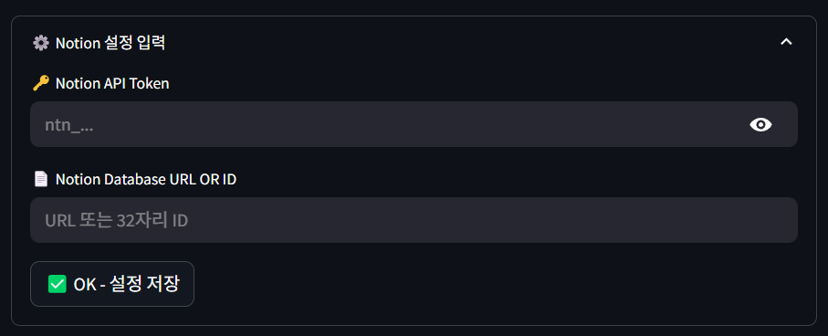

# GOATube 진행 보고서

## 1. 프로젝트 개요

GOATube 프로젝트는 유튜브 링크를 입력받아서 해당 영상에 대한 요약을 생성하고, 생성된 요약을 노션에 저장하는 걸 가능하게 해주는 서비스를 개발하는 프로젝트입니다.

## 2. GOATube 프로젝트의 MVP

### MVP 핵심 기능

MVP에서 구현해야하는 항목은 다음과 같습니다.

1. 유튜브 링크 입력 & 대본 추출
    - 사용자가 유튜브 링크를 입력하면 해당 영상의 정보를 가져와 대본을 추출합니다.
3. 요약 노트 생성
    - 추출한 대본을 기반으로 요약된 노트를 생성합니다.
4. Notion 저장
    - 생성된 요약 노트를 사용자의 Notion 페이지 또는 데이터베이스에 저장합니다.
5. UI 제공
    - 직관적으로 사용할 수 있도록 구성된 간단한 인터페이스를 제공합니다.

### MVP의 수치적 점검

MVP의 완성도를 수치적으로 평가할 수 있는 항목은 다음과 같습니다.

1. 유튜브 링크 처리
    - 90% 이상의 자막 추출 성공률
2. 요약 품질
    - 핵심 내용이 빠지지않은 요약 제공
3. Notion 연동
    - Notion API 연결 성공률 90% 이상
4. 처리 속도
    - 링크 입력부터 노션 저장까지 10분 이내 처리
5. UI
    - 링크 입력부터 노션 저장까지 3단계 이내로 수행할 수 있도록 합니다.

## 3. MVP 대비 현재 구현 완료된 기능

현재 GOATube 프로젝트는 MVP 구현을 완료하였으며, MVP에서 제외한 기능들을 구현하고 있습니다.

- [x] 유튜브 링크 입력 & 대본 추출
- [x] 요약 노트 생성
- [x] Notion 저장
- [x] UI 제공

### UI 제공

Streamlit을 사용함으로써 사용자의 편의성을 중심으로 요약할 유튜브 영상 입력창과 Notion 설정창을 제공합니다.

### 유튜브 링크 입력 & 대본 추출

- 초기 UI에 표시되는 `유튜브 링크 입력`란에 유튜브 링크를 입력할 수 있습니다.

- 유튜브 링크가 정상적으로 입력되면 대본 추출 결과를 표시합니다.

### 요약 노트 생성

- 영상으로부터 정상적으로 대본이 추출된 후 사용자가 `요약 결과 보기`를 클릭하면 하단에 영상 요약 결과를 표시합니다.

### Notion 저장

- `Notion 저장` 기능은 먼저 `Notion 설정 입력` 창에 자신의 Notion API Token과 저장할 노션 페이지 URL을 입력합니다.

- 영상 요약이 완료되면 하단에 `요약 노트 다운로드` 버튼과 `Save to Notion as Page` 버튼이 생성됩니다. `Save to Notion as Page` 버튼을 누르면 앞서 설정한 Notion 설정에 따라 노션에 요약 결과를 저장합니다.
- 저장이 완료되면 사진과 같이 저장 완료 메시지가 표시됩니다.

## 4. 주요 기술적 도전 과제 및 해결 방안

### 현재까지 발생했던 기술적 도전 과제

- Youtube 영상으로부터 대본을 얻어오는 과정에서, 배포 환경에서 Youtube가 이 프로젝트를 `봇`으로 판단해 대본을 추출할 수 없는 경우
- Notion 연결 과정에서, Notion 연결이 불가능한 경우

## 5. 남은 작업(To-Do) 및 태스크

## 피드백 받고 싶은 항목

